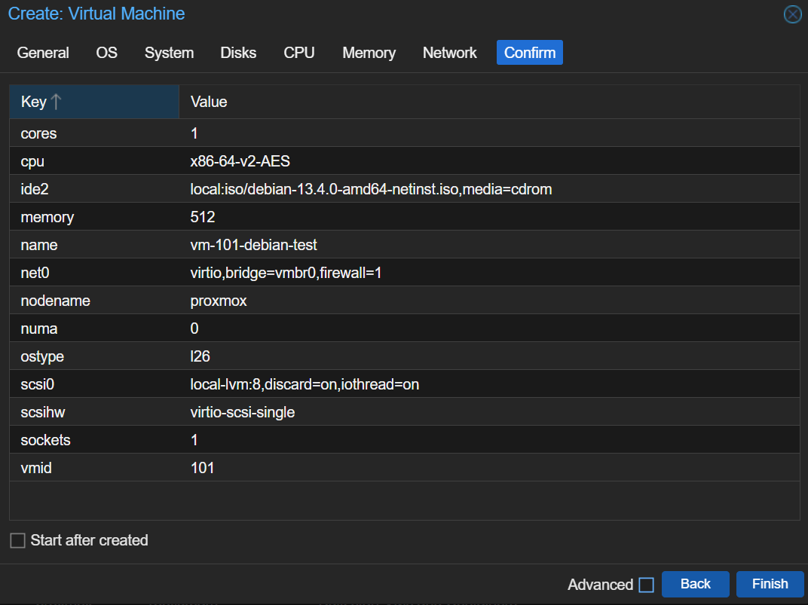
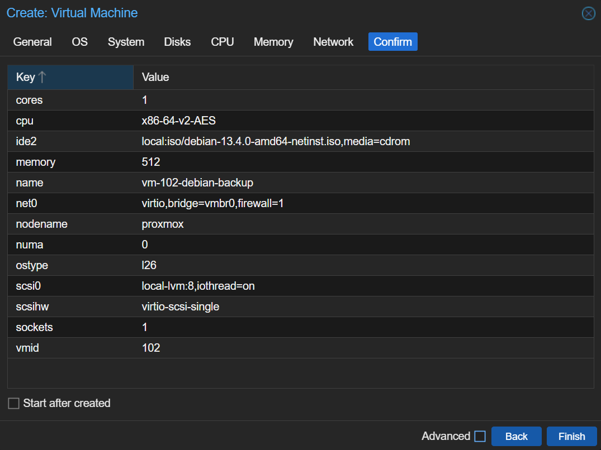
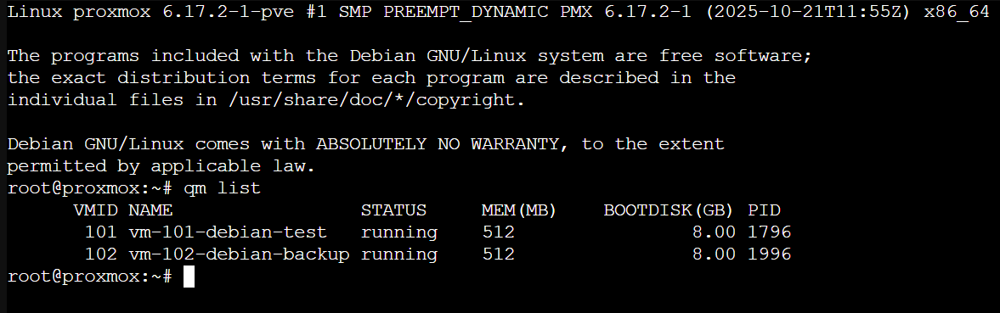
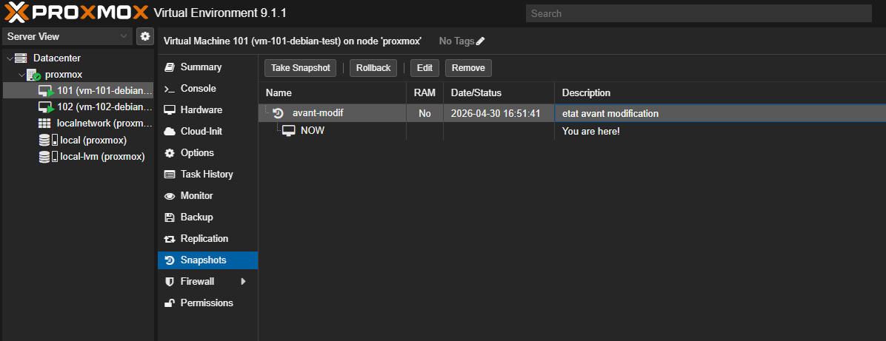
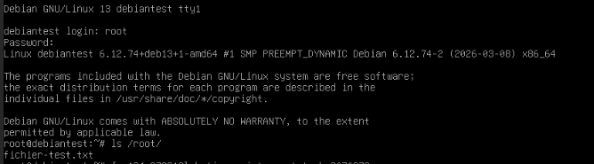
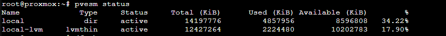
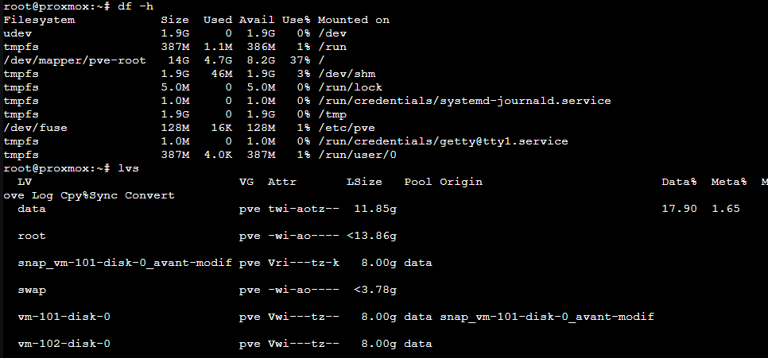

# Semaine 5 - Gestion des VMs Proxmox : création, snapshots, stockage

## 1. Objectif

Apprendre à gérer des machines virtuelles dans Proxmox :

- Créer et configurer plusieurs VMs
- Utiliser les snapshots pour protéger un état
- Comprendre le stockage Proxmox

---

## 2. Création des VMs

### Paramètres utilisés

| Paramètre | VM 101 — vm-101-debian-test | VM 102 — vm-102-debian-backup |
|-----------|----------------------|------------------------|
| VM ID | 101 | 102 |
| OS | Debian 13 (netinst) | Debian 13 (netinst) |
| RAM | 512 Mo | 512 Mo |
| vCPU | 1 core, 1 socket | 1 core, 1 socket |
| Disque | 8 Go (local-lvm) | 8 Go (local-lvm) |
| Réseau | vmbr0, VirtIO | vmbr0, VirtIO |
| Discard | Activé | Activé |
| KVM | Désactivé (lab VMware) | Désactivé (lab VMware) |

### Étapes de création (via l'interface web)

1. Cliquer sur **Create VM** en haut à droite
2. **General** : renseigner VM ID et Name
3. **OS** : sélectionner l'ISO Debian 13, Type Linux, version 6.x
4. **System** : tout par défaut
5. **Disks** : Storage `local-lvm`, taille 8 Go, cocher `Discard`
6. **CPU** : 1 socket, 1 core
7. **Memory** : 512 Mo
8. **Network** : Bridge `vmbr0`, modèle `VirtIO`
9. Vérifier le résumé → **Finish**




### Vérification

```bash
qm list                        # Liste toutes les VMs avec leur statut
qm status 101                  # Statut détaillé de la VM 101
```



---

## 3. Snapshots

Un snapshot capture l'état exact d'une VM à un instant T. Il permet de revenir en arrière en cas de problème.

> **Snapshot ≠ Backup** : un snapshot reste lié au disque de la VM. Si le disque est perdu, le snapshot l'est aussi. Un backup est une copie indépendante stockée ailleurs.

### Test pratique effectué

**Étape 1 — Créer un fichier témoin dans la VM 101**

```bash
# Dans la VM 101 (connecté en root)
echo "etat avant modification" > /root/fichier-test.txt
cat /root/fichier-test.txt
```

**Étape 2 — Créer le snapshot depuis le shell Proxmox**

```bash
# Depuis le shell Proxmox
qm snapshot 101 avant-modif --description "etat avant modification"
qm listsnapshot 101            # Vérifier que le snapshot existe
```



**Étape 3 — Modifier l'état de la VM**

```bash
# Dans la VM 101
rm /root/fichier-test.txt
ls /root/                      # Vérifier que le fichier a disparu
```

**Étape 4 — Restaurer le snapshot**

```bash
# Depuis le shell Proxmox (VM doit être arrêtée)
qm stop 101
qm rollback 101 avant-modif
qm start 101
```

**Étape 5 — Vérifier le rollback**

```bash
# Dans la VM 101 après redémarrage
ls /root/                      # fichier-test.txt est revenu
```



---

## 4. Stockage Proxmox

Proxmox utilise deux zones de stockage principales :

- **`local`** (type `dir`) : stocke les ISOs et les backups
- **`local-lvm`** (type `lvmthin` (lvm = Logical Volume Manager et thin indique qu'il utilise l'espace à la demande)) : stocke les disques des VMs

Avec `local-lvm` Proxmox n'alloue pas les 8 Go d'un coup au moment de la création de la VM. Il prend l'espace au fur et à mesure que la VM écrit des données. On le voit dans `lvs`: le disque configuré à 8 Go n'en occupe qu'une portion. C'est ce qu'on appelle le thin provisioning.

```bash
pvesm status                   # Vue d'ensemble du stockage
df -h                          # Espace disque global
lvs                            # Volumes LVM détaillés
```




---

## 5. Problèmes rencontrés et solutions

### KVM non disponible dans VMware

**Erreur** :
```
TASK ERROR: KVM virtualisation configured, but not available.
```

**Cause** : Proxmox tourne dans VMware qui ne supporte pas la virtualisation imbriquée sur cette configuration.

**Solution** : Désactiver KVM sur chaque VM :
```bash
qm set 101 --kvm 0
qm set 102 --kvm 0
```

### VMware ne démarre plus après modification des paramètres

**Erreur** :
```
La fonction « hv.capable » était 0, mais doit être au minimum 0x1.
Échec de l'activation du module 'FeatureCompatLate'.
```

**Solution** : Modifier le fichier `.vmx` de la VM VMware :
```
hypervisor.cpuid.v0 = "FALSE"
vhv.enable = "FALSE"
```

---

## 6. Ce qu'il faut retenir

- Une VM Proxmox se crée via l'interface web ou en CLI avec `qm`
- Toujours activer `Discard` sur les disques en `local-lvm`, cela permet à Proxmox de récupérer l'espace disque libéré quand la VM supprime des fichiers
- Les snapshots permettent de revenir en arrière rapidement mais ne remplacent pas les backups
- `local-lvm` n'utilise l'espace disque qu'au fur et à mesure — pas d'un seul coup
- En lab dans VMware, KVM doit être désactivé (`--kvm 0`)